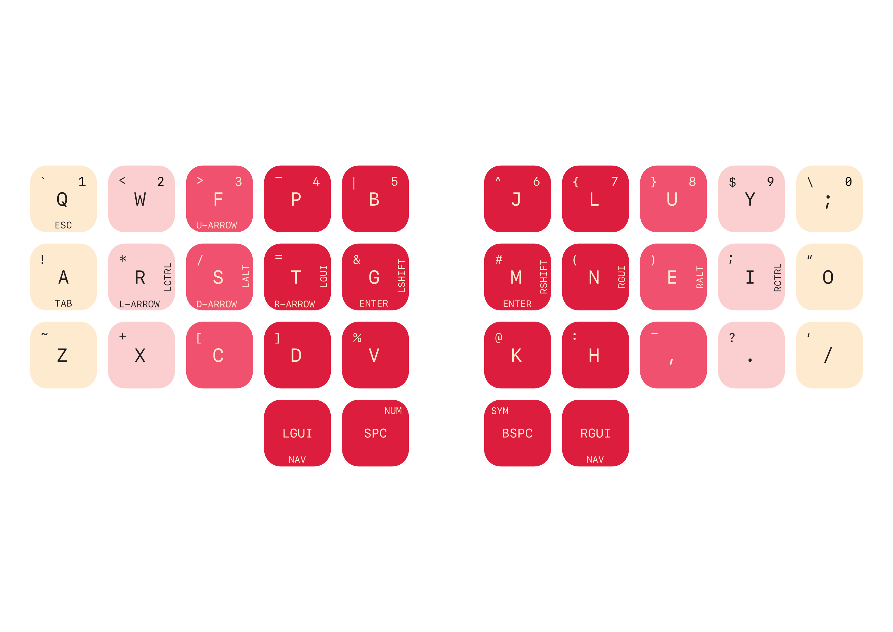
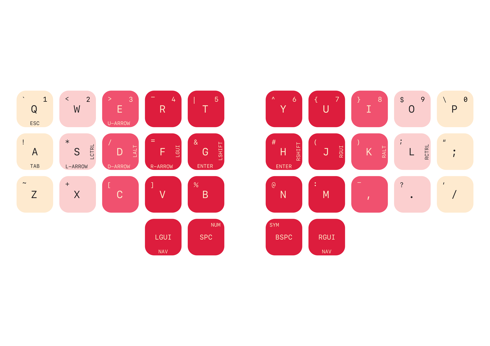

# Forager ZMK Module

This is the ZMK module for [the Forager keyboard](https://github.com/carrefinho/forager).

[ZMK Studio](https://zmk.dev/docs/features/studio) is supported and enabled by default.

# Colemak-DH Layout



# QWERTY Layout



# Usage

Add these lines to `config/west.yml` in your `zmk-config` repository:

```yaml
manifest:
  remotes:
    - name: zmkfirmware
      url-base: https://github.com/zmkfirmware
    - name: carrefinho                            # <---
      url-base: https://github.com/carrefinho     # <---
    - name: caksoylar                             # <---
      url-base: https://github.com/caksoylar      # <---
  projects:
    - name: zmk
      remote: zmkfirmware
      revision: main
      import: app/west.yml
    - name: forager-zmk-module                    # <---
      remote: carrefinho                          # <---
      revision: main                              # <---
    - name: zmk-rgbled-widget                     # <---
      remote: caksoylar                           # <---
      revision: main                              # <---
  self:
    path: config
```

Then add `forager_left` and `forager_right` shields to your `build.yaml`:

```yaml
---
include:
  - board: seeeduino_xiao_ble
    shield: forager_left rgbled_adapter
    snippet: studio-rpc-usb-uart
  - board: seeeduino_xiao_ble
    shield: forager_right rgbled_adapter
```

For more information on ZMK Modules and building locally, see [the ZMK docs page on modules.](https://zmk.dev/docs/features/modules)
